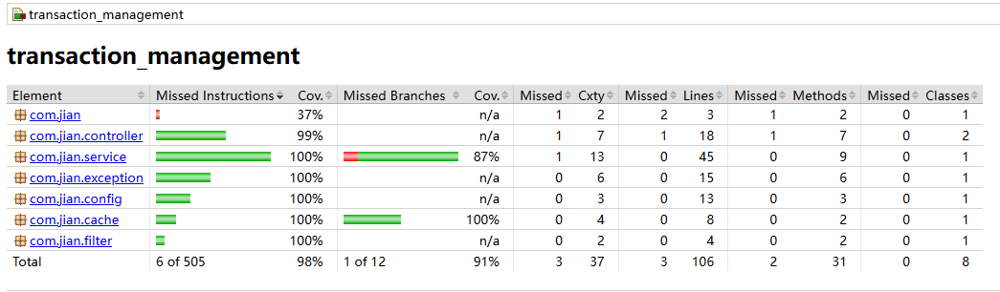
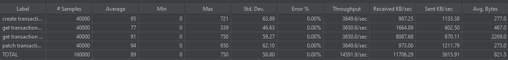

# transaction_management
A little JAVA app  with simple UI

## Database

H2 in-memory databases

## Cache

Default

## 3rd Dependency

| Component               | purpose                         |
| ------------------- |---------------------------------|
| spring-boot-starter-web| spring boot web start           |
| spring-boot-starter-test | testing                         |
| spring-boot-starter-data-jpa| JPA-based repositories          |
| spring-boot-starter-validation | validate user input             |
| spring-boot-starter-cache | cache                           |
| lombok     | generate known patterns of code |
| h2      | in-memory databases             |
| springdoc-openapi-starter-webmvc-ui | API documentation               |
| caffeine | cache               |


## Getting Started

### Prerequisites

* IDE - IDEA or other
* JAVA 21

### Compiling
In the root path, run Maven command to compile
```
mvn clean compile
```

### Installing
In the root path, run Maven command to install
```
mvn clean install -DskipTests
```

### Build for local
In the root path, run Maven command to package
```
mvn clean package -DskipTests
```

### Running
Run "Application" with active profile "local"

### Running in docker
In the root path, run Docker command to build
```
docker build -t rmapp:1.0 .
docker run -d -p 8080:8080 --name rmapp -e "SPRING_PROFILES_ACTIVE=local" rmapp:1.0
```

## Authentication

No

## UI

After running application locally, see below URL for UI

http://localhost:8080/index.html


## API SPEC

After running application locally, see below URL for swagger
http://localhost:8080/swagger-ui/index.html#/


## Testing

### Code coverage


### JMeter

